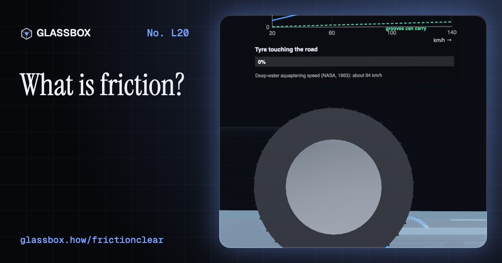
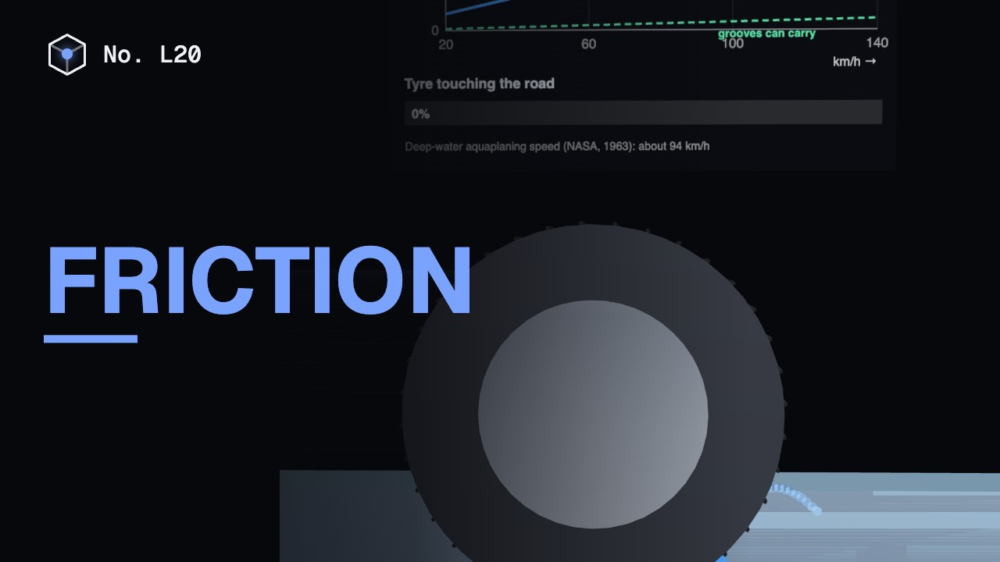
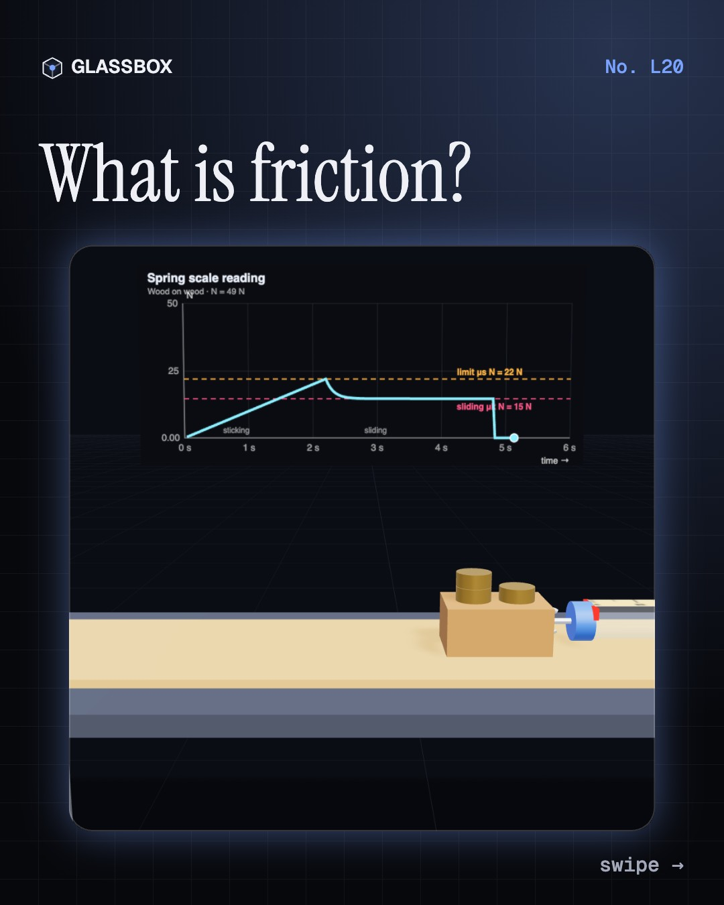
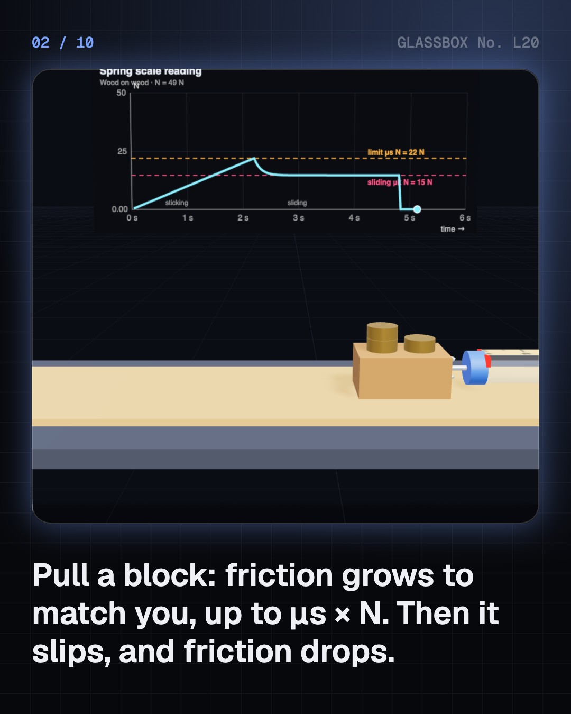
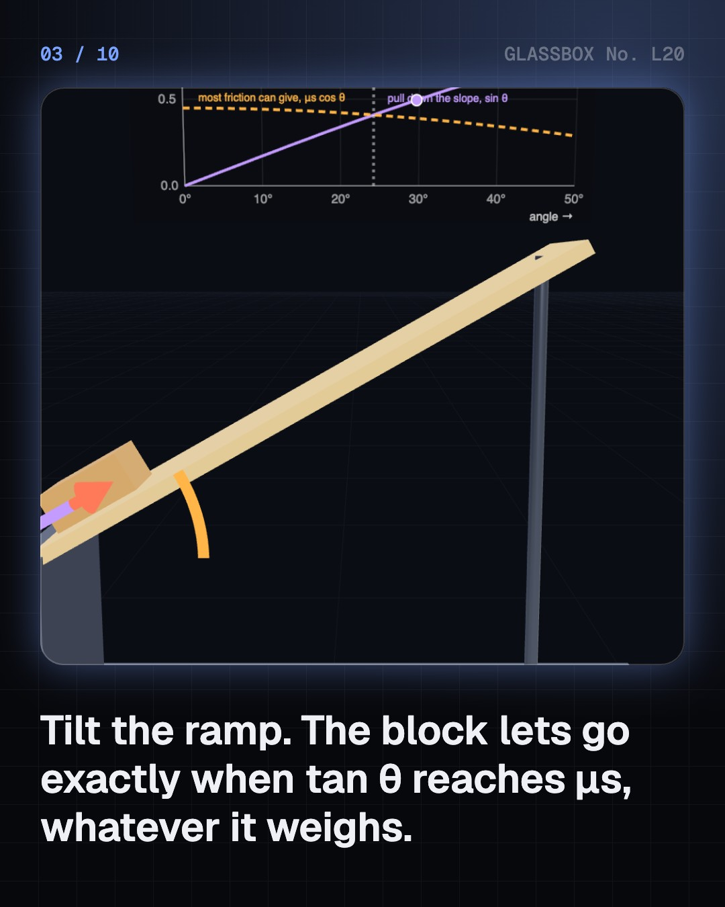
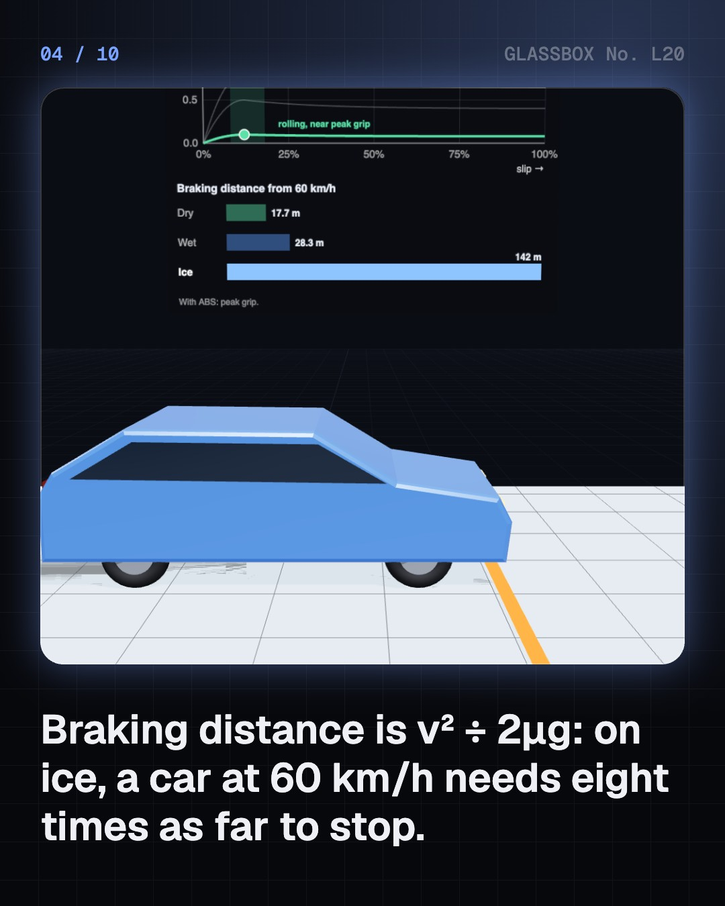

<!-- glassbox:start -->
<!-- Generated from glassbox.json by the Glassbox hub (npm run readme -- frictionclear). Edit glassbox.json, not this block. -->
<p align="center"><a href="https://glassbox.how/e/frictionclear/"></a></p>

<h1 align="center">Friction</h1>

<p align="center"><b>What is friction?</b><br>Friction is the force that holds before it slips. Pull a block with a spring scale and watch the grip peak then drop, stop a car on dry roads and ice, float a crankshaft on oil, hold a boat with one hand and three turns of rope, and bust the myth that pressure makes ice slippery.</p>

<p align="center"><a href="https://glassbox.how/frictionclear/"><b>▶ Play with it</b></a> &nbsp;·&nbsp; <a href="https://glassbox.how/e/frictionclear/">Read the 60-second explainer</a> &nbsp;·&nbsp; <a href="https://glassbox.how/frictionclear/glassbox/reel.mp4">Watch the 40-second video</a></p>

<p align="center">
  <a href="https://glassbox.how/e/frictionclear/"></a>
  <a href="https://glassbox.how/e/frictionclear/"></a>
  <a href="LICENSE"></a>
  <a href="LICENSE-CONTENT.md"></a>
  <a href="#privacy"></a>
</p>

## In 60 seconds

1. **Grip, then slip.** Friction resists sliding. Static friction matches your pull up to a limit, μs × N; past it the surface lets go and sliding friction, μk × N, is usually smaller. μ has no unit. Tilt a ramp until a block slides and tan θ = μs. Surfaces really touch only at the tips of tiny bumps.
2. **Grip on the road.** Tyres drive, steer and stop through static friction: μ about 0.8 dry, 0.5 wet, 0.1 on ice. Braking distance is v² ÷ 2μg, so ice means eight times as far. ABS keeps wheels just short of locking. Worn tread can't clear water and the tyre aquaplanes.
3. **Friction we fight.** Rolling needs about 1% of the weight for a car, a hundredth of dragging it. Ball bearings run at μ ≈ 0.0015. An oil film floats a crankshaft off the metal, as the Stribeck curve shows. Whatever friction remains becomes heat, enough to make brake discs glow.
4. **Friction we need.** Each step pushes the ground back so the ground pushes you forward, needing μ ≈ 0.18. A pen's ball rolls only because paper grips it. Rope round a post grips exponentially, T₀ e^(μθ). Rosin makes a violin bow stick and slip hundreds of times a second.
5. **Myths and limits.** Friction doesn't depend on contact area. Ultra-smooth clean metals stick and can even cold-weld. Pressure lowers ice's melting point by only about 1.5 °C under a skate: ice is slippery because of its wet surface layer and frictional heating. Twisted graphite is superlubric, and air drag grows with speed squared.

## Words worth knowing

| Term | Meaning |
|---|---|
| **Friction** | The force between touching surfaces that resists them sliding over each other. |
| **Normal force** | How hard two surfaces are pressed together, at right angles to them. On a flat table it equals the weight. |
| **Coefficient of friction (μ)** | Friction divided by normal force. It has no unit and depends on the two surfaces. |
| **Static and kinetic friction** | Static friction stops sliding from starting, up to μs × N; kinetic friction acts once sliding, about μk × N. |
| **Real contact area** | The tiny fraction of a surface that actually touches, at the tips of its bumps. It grows with the load. |
| **Rolling resistance** | The small drag on a rolling wheel, Crr × weight: about 1% for a car tyre. |
| **Lubrication** | A film of oil or grease that keeps surfaces apart and cuts friction. |
| **Stick–slip** | Jerky motion where surfaces stick, build up force, slip and stick again: violins, squeaks and earthquakes. |

## A short history

**From Egyptian workers pouring water under a 58-tonne statue to graphite flakes that slide with almost no friction at all: how people learned to measure, tame and explain the force that grips.**

- **1900 BCE** · Water under the sledge (Workers of the nomarch Djehutihotep, Deir el-Bersha, Egypt)
- **1493** · Leonardo's sliding blocks (Leonardo da Vinci, Milan, Italy)
- **1699** · Amontons's laws (Guillaume Amontons, Paris, France)
- **1785** · Coulomb tests everything (Charles-Augustin de Coulomb, Rochefort and Paris, France)
- **1850** · A wet skin on ice (Michael Faraday, Royal Institution, London, England)
- **1950** · The real area of contact (Frank Philip Bowden and David Tabor, Cambridge, England)
- **1978** · Anti-lock brakes in showrooms (Bosch and Mercedes-Benz, Stuttgart, Germany)
- **2004** · Superlubricity seen (Martin Dienwiebel, Joost Frenken and colleagues, Leiden, Netherlands)

The full story, with 20 moments, charts, people and 24 sources: [glassbox.how/e/frictionclear/history](https://glassbox.how/e/frictionclear/history/). The data lives in [`history.json`](history.json).

## Video and slides

Made with the Glassbox studio from this box's storyboard (`window.glassbox.director`). Free to reuse under CC BY 4.0.

<a href="https://glassbox.how/frictionclear/glassbox/video.mp4"></a>

<p><a href="glassbox/slide-1.jpg"></a> <a href="glassbox/slide-2.jpg"></a> <a href="glassbox/slide-3.jpg"></a> <a href="glassbox/slide-4.jpg"></a></p>

| File | What | Size |
|---|---|---|
| [`glassbox/reel.mp4`](https://glassbox.how/frictionclear/glassbox/reel.mp4) | Reel / Short, with captions and soundtrack | 1080×1920 |
| [`glassbox/video.mp4`](https://glassbox.how/frictionclear/glassbox/video.mp4) | YouTube video, with captions and soundtrack | 1920×1080 |
| `glassbox/slide-1…10.jpg` | Instagram carousel | 1080×1350 |
| `glassbox/thumb.jpg` | YouTube thumbnail | 1280×720 |
| `glassbox/cover.jpg` | Share card and repo social preview | 1200×630 |
| [`glassbox/history-reel.mp4`](https://glassbox.how/frictionclear/glassbox/history-reel.mp4) | “History in 10 moments” Reel / Short | 1080×1920 |
| `glassbox/history-slide-*.jpg` | History carousel | 1080×1350 |
| `glassbox/post.json` | Post copy and schedule used by the publish kit | |

## Privacy

This box has no accounts and no ads, and it ships its own fonts and libraries. When you run it yourself it sends nothing anywhere. On glassbox.how, the site's `/bar.js` also loads Glassbox's analytics: **Google Analytics** to count visits (it asks first in the EU, UK and Switzerland, and stays off when your browser sends Global Privacy Control or Do Not Track) and **ClickTrust** to detect bots.

It remembers a few things **in your own browser only**, and never sends them anywhere:

| Browser storage key | What it holds |
|---|---|
| `frictionclear.v1` | Which chapters you have opened, your best quiz scores, and sound on or off. |

Exactly what each one sees is at [glassbox.how/privacy](https://glassbox.how/privacy/).

## Licences

- **Code:** [MIT](LICENSE). Use it, change it, ship it.
- **Explanations, text, images and videos** (`glassbox.json`, `glassbox/`): [CC BY 4.0](LICENSE-CONTENT.md). Credit “Glassbox, glassbox.how/e/frictionclear”.
- **Third-party parts** keep their own licences: [three.js](https://threejs.org) (MIT), [Geist, Instrument Serif](https://openfontlicense.org) (SIL OFL 1.1).
- The Glassbox name and logo aren't covered by either licence. See the [terms](https://glassbox.how/terms/).

Found a mistake? [Open an issue](https://github.com/bdeeps/frictionclear/issues). Corrections happen in public.
<!-- glassbox:end -->

## Run it

It's plain HTML, CSS and JavaScript. No build step and no dependencies. Run locally, it contacts no other website.

```bash
python3 -m http.server 8000
```

Three.js and the fonts ship in `vendor/` and `fonts/`, so it also works offline.

Then open http://localhost:8000.

## How it's built

| File | What |
|---|---|
| `index.html`, `css/app.css` | The page and its styles |
| `js/app.js`, `js/stage.js`, `js/ui.js`, `js/kit.js` | The shared Glassbox 3D engine: chapters, 3D stage, controls, quiz, video director |
| `js/chapters/*.js` | One file per chapter: the 3D model, controls, text, key terms, quiz and video scenes |
| `js/friction.js` | Shared parts and physics: friction coefficients, braking distance, chart boards, force arrows, a spring scale, rough surfaces for the close-ups, people, a car and a road |
| `glassbox.json` | Title, question, explainer beats, key terms, browser storage and credits shown on glassbox.how |
| `reel` in each chapter | The storyboard the Glassbox studio records into short videos |
| `glassbox/` | The published video, slides, thumbnail and post copy |
| `fonts/`, `vendor/three/` | Self-hosted Geist and Instrument Serif (SIL OFL 1.1) and three.js (MIT) |
